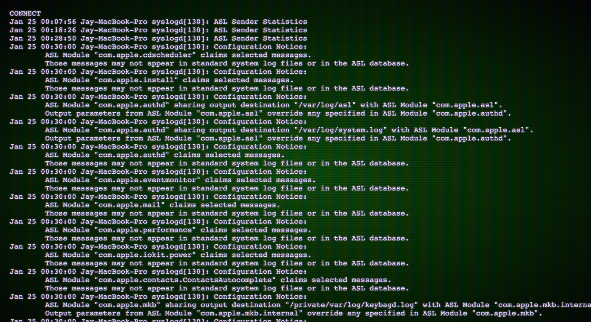

# ws-to-webpage
A simple way to display the output of system websocket in a web page with a nice vintage old school terminal look and feel.

## Pre-requisite: 
- [websocketd](https://github.com/joewalnes/websocketd): Small command-line tool that will wrap an existing command-line interface program, and allow it to be accessed via a WebSocket. WebSocket-capable applications can be built very easily with this. As long as you can write an executable program that reads STDIN and writes to STDOUT, you can build a WebSocket server. No networking libraries necessary.
- we use Visual Studio to edit; the .scss file(s) are converted into .css within Visual Studio with the "Live Sass Compiler" add-on (it compiles .scss into .css)
- [wscat](https://github.com/websockets/wscat/blob/master/README.md): WebSocket cat. It's similar to curl but for WebSockets (URL starting with ```ws://```). It will be great to test websocketd.

## Installation:
- Just clone the repository
- Make sure [websocketd](https://github.com/joewalnes/websocketd/blob/master/README.md) is installed on the server.
- Launch it with the following command so it redirects the output of ````script.sh```` (or whatever script or command you like) to WebSocket onto port ````8080```` (or whatever port you prefer)
````
$ websocketd --port=8080 --loglevel=debug ./script.sh
````

Websocketd is now "streaming" the output of ````./script.sh```` onto the port 8080.

Now test that you actually can connect to this port locally and that you get the "feed" of data; To do this we use the simple command line tool "[wscat](https://github.com/websockets/wscat/blob/master/README.md)". From the same machine run the following command:

````
$ wscat --connect ws://localhost:8080
````

This is great, it works locally on the command line, let's now display the same feed of data into a web page with a nice vintage touch: 

The following elements are used to build the web page:
- ````ws.html````: The presentation page (````ws```` stands for WebSocket)
- ````vintage-terminal.scss````: Used to generate the "vintage terminal" look .css     *Live Sass Compiler* generates the .css from this file (in case you don't see it in the repository).
- ````flicker.css````: Adds an extra layer of slight flicker effect to the screen content.

To test you can simply access ````ws.html```` using your internet browser since it's a completely static page. 

To the outside world you would access it through a web server e.g. apache, nginx ...  just make sure you adjust ````SERVER:PORT```` in ````ws.html````:
`````
var ws = new WebSocket('ws://SERVER:PORT/');
`````

Also make sure that no firewall is blocking PORT.




